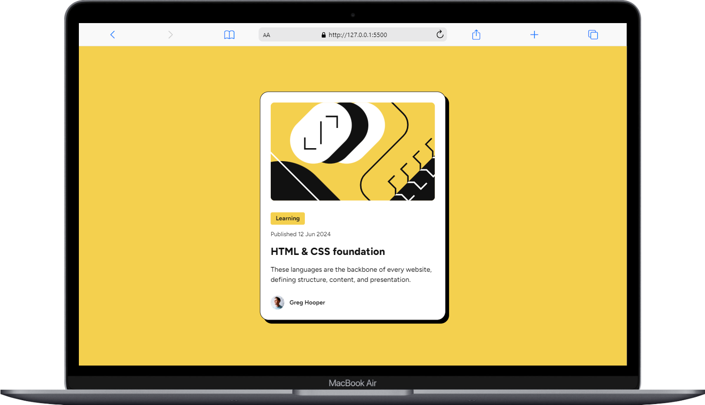
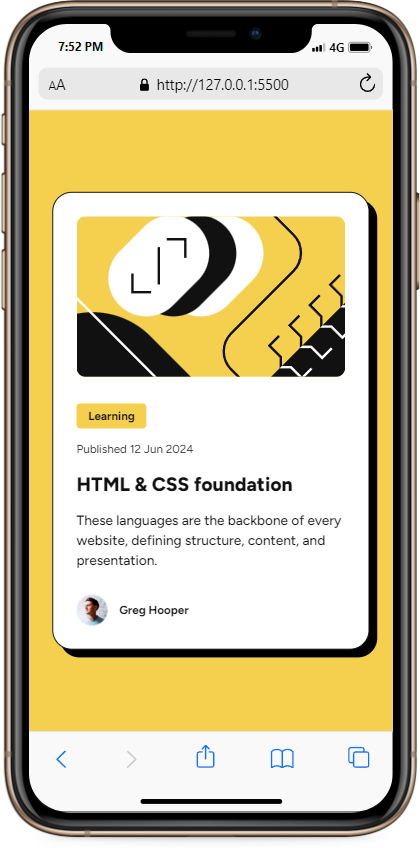

# Frontend Mentor - Blog preview card solution

This is a solution to the [Blog preview card challenge on Frontend Mentor](https://www.frontendmentor.io/challenges/blog-preview-card-ckPaj01IcS). Frontend Mentor challenges help you improve your coding skills by building realistic projects.

## Table of contents

- [Overview](#overview)
  - [The challenge](#the-challenge)
  - [Screenshot](#screenshot)
  - [Links](#links)
- [My process](#my-process)
  - [Built with](#built-with)
  - [What I learned](#what-i-learned)
  - [Continued development](#continued-development)

**Note: Delete this note and update the table of contents based on what sections you keep.**

## Overview

### The challenge

Users should be able to:

- See hover and focus states for all interactive elements on the page

### Screenshot

### Desktop Preview

### Mobile Preview

### Links

- Solution URL: [Add solution URL here](https://your-solution-url.com)
- Live Site URL: [Add live site URL here](https://your-live-site-url.com)

## My process

In this learning experience, I tried building a website with a mobile-first approach. Since this is a Free+ challenge, it also provided the Figma file. Because of that, I could see the text and color styles.

So, first, I created classes for the text styles. Second, I used variables to define the colors that would be used. Then, I continued to create the HTML, define all the classes, and style it with CSS

### Built with

- Semantic HTML5 markup
- CSS custom properties
- Flexbox

**Note: These are just examples. Delete this note and replace the list above with your own choices**

### What I learned

In this challenge, I continued to practice my HTML and CSS. From this challenge, I learned one new thing: you can affect other elements on hover.

I also learned to use variables in CSS for color styles. I find it easy to manage colors this way, and it makes bulk changes much easier.

### Continued development

Continue to practice my HTML and CSS before continue to the Javascript.
